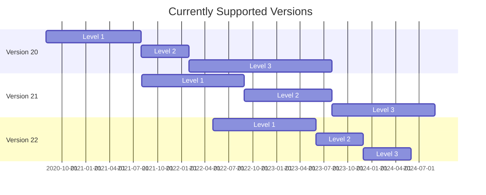

# Salesforce Commerce Cloud Adyen Cartridge

Adyen provides a LINK cartridge to integrate with [Salesforce Commerce Cloud (SFCC)](https://www.adyen.com/partners/salesforce-commerce-cloud). This cartridge enables a SFCC storefront to use the Adyen payment service. This cartridge [supports](https://docs.adyen.com/plugins/salesforce-commerce-cloud#supported-versions) SFRA version 5.x.x & 6.x.x and SiteGenesis JS-Controllers version 103.1.11 and higher.

## Integration
This cartridge allows you to integrate with Adyen without the need for any development work from your end. It allows you to process payments using the [checkout API](https://docs.adyen.com/api-explorer/#/CheckoutService/v67/overview), and for Point of Sale (POS) payments, it uses a cloud-based [Terminal API](https://docs.adyen.com/point-of-sale/terminal-api-fundamentals). As for the client side, Adyen’s [web components](https://docs.adyen.com/online-payments/components-web) are used to render payment methods.

## Requirements

It is required to have an Adyen account to use the cartridge. You can do this [here](https://www.adyen.com/signup).

## Installation, Usage and Configuration

Installation, Usage and Configuration is explained in Adyen's [online documentation](https://docs.adyen.com/plugins/salesforce-commerce-cloud/).

Apple Pay configuration can be found [here](https://docs.adyen.com/plugins/salesforce-commerce-cloud/set-up-payment-methods/#set-up-apple-pay-on-the-web).

## Testing
End-to-End tests can be found in the `adyen-salesforce-commerce-cloud/tests/e2e` directory. 
They are run automatically via Github Actions using the `E2E.yml` workflow.
To run the tests locally use the following command:
```
`npm run test:e2e`
```
Note: Please make sure to fill in the environment variables in the `fixtures` directory before running the tests locally.

As for Unit tests, they are currently only available for SFRA. Test files can be found next to the files they are testing. Mocks are kept in the `jest` directory.
To run SFRA unit tests locally use the following command:
```
`npm run test`
```
## Support & Maintenance

We provide three levels of support:
1. **Level 1 (12 months)**: full support (including new features) *Keep in mind that some new features are not possible on older versions, therefore this is not inclusive of ALL new features that are built.* 
2. **Level 2 (12 months - 18 months)**: high priority bugs / security only.
3. **Level 3 (18 months - 24 months)**: security updates only (no support from support team).

> After Level 3 there is no support or maintenance from Adyen and it should be treated as a native integration of the merchant.

The schedule for the current maintained branches is:

|  Plugin Major Version   |  Release Date  |  Level 1 Support ends   |  Level 2 Support ends   |  Level 3 Support ends  |
|  :-----          |  :-----          |  :-----          |  :-----          |  :-----          |
|  Version 20 |  July 2020  |  End of July 2021 |  End of Jan 2022 |  End of July 2023 |
|  Version 21 |  August 2021 |  End of August 2022 |  End of July 2023 |  End og August 2024 |
|  Version 22 |  May 2022 |  End of March 2023 |  End of Nobember 2023 | End of May 2024 |
|  Version 23 |  - |  12 months after release |  18 months after release |  24 months after release |

Or, visualised as a calendar:



## Contributing
We strongly encourage you to join us in contributing to this repository so everyone can benefit from:
* New features and functionality
* Resolved bug fixes and issues
* Any general improvements

Read our [**contribution guidelines**](CONTRIBUTING.md) to find out how.

## Platform

Read more information about the [Adyen platform](https://www.adyen.com/platform).

## Licence

MIT license see LICENSE.
