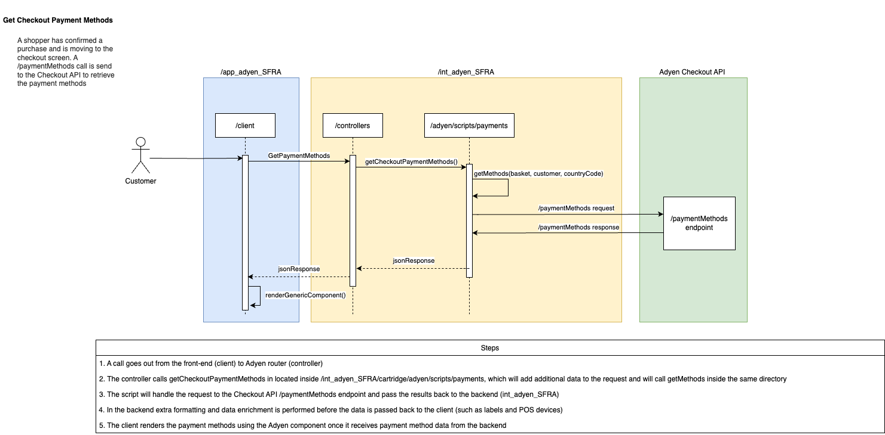
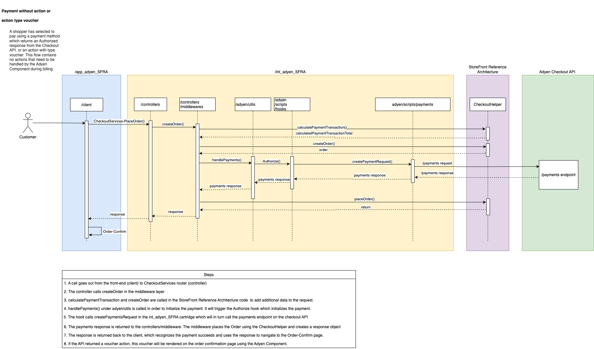
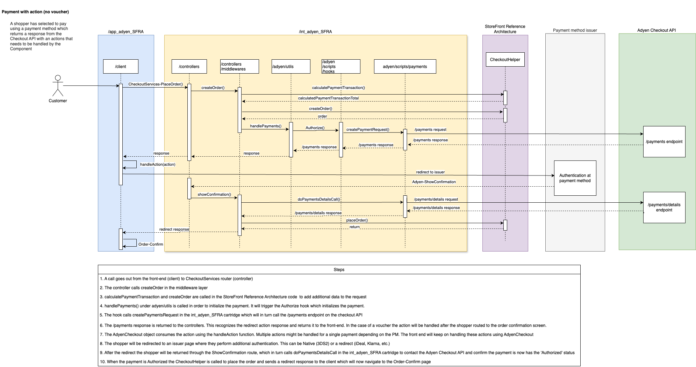
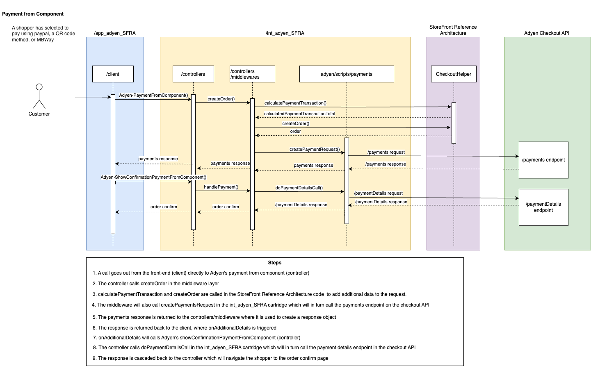
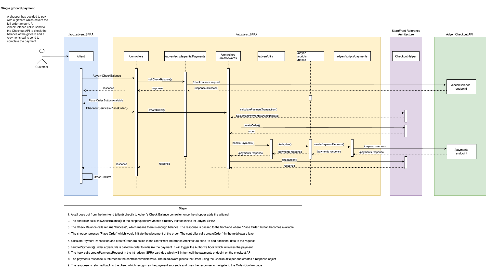
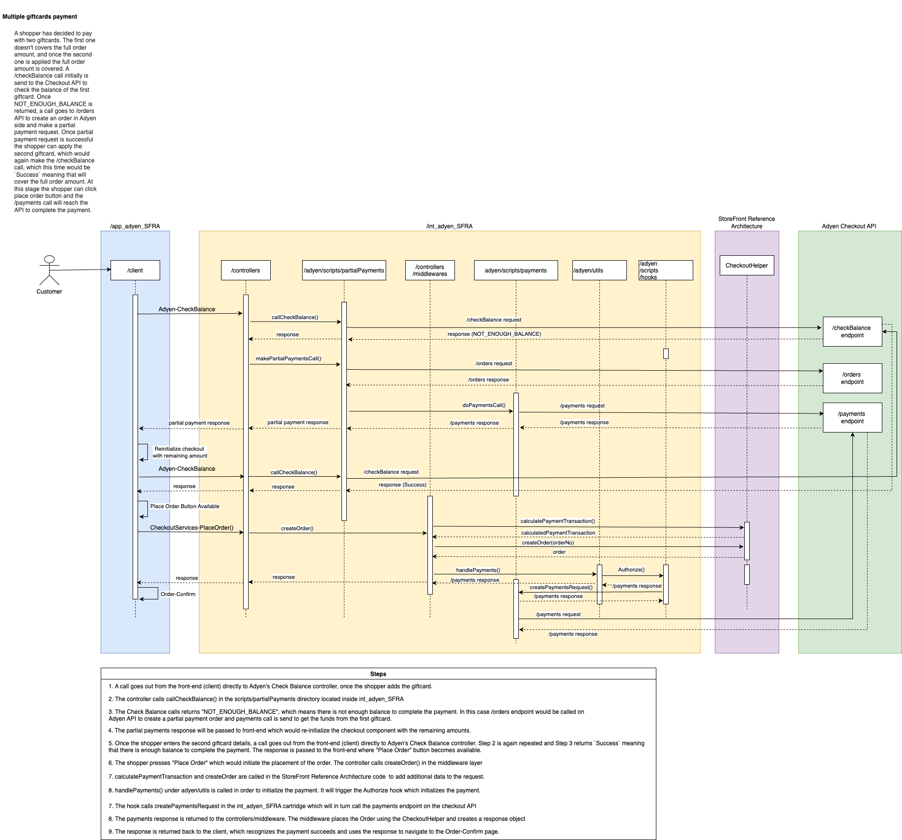
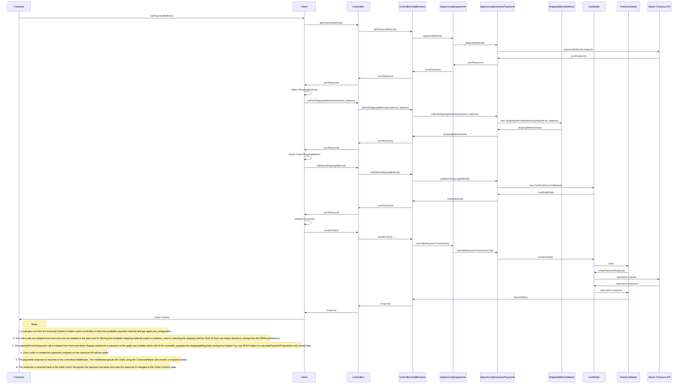

# Adyen Salesforce Commerce Cloud Integration

Integrate Adyen with Salesforce Commerce Cloud using the Storefront Reference Architecture (SFRA). This method provides seamless access to Adyen's extensive payment features through the Adyen payments cartridge.
&nbsp; 

The documentation includes detailed diagrams to help you understand the integration process and enhance your e-commerce capabilities using Adyen's robust payment solutions.
&nbsp;

For more details, visit the [Adyen Salesforce Commerce Cloud documentation](https://docs.adyen.com/plugins/salesforce-commerce-cloud/).

The below flow diagrams are applicable to this release.

## Get Payment Methods

## Payment Without Action
Example payment methods, that are covered by this flow: Cards without 3DS, SepaDirectDebit 

## Payment With Action
Example payment methods, that are covered by this flow: 3DS2 Cards, Bancontact, Amazon Pay

## Payment From Component
Example payment methods, that are covered by this flow: PayPal, MBWay, Apple Pay

## Single Giftcard Flow

## Multiple Giftcards Flow

## Apple Pay Express
Example payment methods, that are covered by this flow: Apple Pay Express from Cart/mini-cart

## PayPal Express
Example payment methods, that are covered by this flow: PayPal Express from Cart/mini-cart
xxxxx
